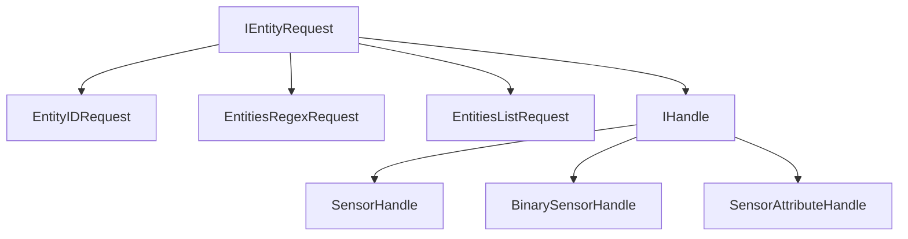

# Vowels Storage Architecture Design

> **Status:** Drafted
> **Date:** 2026-05-10
> **Topic:** High-performance, reactive time-indexed storage engine

## Goal
Architect a storage and registry system for Vowels that supports high-performance historical queries, live data streaming, and future forecasting, all while maintaining Native AOT compatibility and a modular plugin architecture.

## Architecture

### 1. The Request & Identity Hierarchy
Vowels uses an "inverse hierarchy" where identity is a specialized form of a request. This allows the API to be extremely flexible.



- **IEntityRequest**: The base contract for all data queries.
- **IHandle**: A specific, concrete identity. Matches only itself.
- **EntityIDRequest**: Matches a string ID (e.g., 'sensor.temp'). May return values from multiple handles if the schema changes over time.

### 2. Reactive Data Flow
All data retrieval is driven by Reactive Extensions (Rx).

#### `GetEntityValues(IObservable<IEntityRequest> requests, DateTime start, DateTime end)`
1. **Input Stream**: Accepts a stream of requests.
2. **Historical Segment**: If `start < now`, the `IStoreRegistry` is queried for files covering the range.
3. **Live Segment**: If `end > now`, the `EntityRegistry` subscribes to live sources (e.g., Home Assistant WebSocket).
4. **Output Stream**: A merged `IObservable<IEntityValue>`.
   - **Historical data** completes once the range is read.
   - **Live data** remains open until `end` is reached or the subscription is disposed.

### 3. Layered Responsibility

#### Vowels.Core.Common (Contract Layer)
- Defines `IHandle`, `IEntityRequest`, `IEntityValue`.
- Defines `VowelsType` and `IEntityRegistry`.
- Defines `IStoreRegistry`.
- Light-weight, zero implementation, AOT-friendly.

#### Vowels.Core (Core Logic)
- Implements `EntityRegistry`.
- Coordinates between the Storage Engine and external Data Sources.
- Handles handle "enrichment" (Dummy -> Enriched).

#### Vowels.Core.Storage (Implementation Layer)
- Implements `FileStoreManager` (initially).
- Orchestrates multiple hourly Memory Mapped Files (MMFs).
- Handles LRU caching and background compression of historical files.

## Data Structures

### IEntityValue
```csharp
public record EntityValue(
    IHandle Handle,      // The concrete identity that produced this value
    DateTime Timestamp, 
    byte Confidence,     // 0 = Forecast, 255 = Actual
    VowelsType Type, 
    object Value
);
```

### VowelsType
Supported types for binary serialization and UI representation:
- `Double`, `Int64`, `Boolean`, `StringId`, `Blob`, `Timestamp`.

## Plugin Strategy (Option B)
Plugins are loaded as **Native Shared Libraries**.
- Supports dynamic "upload" via Web UI.
- Uses `NativeLibrary.Load` and `[UnmanagedCallersOnly]` for cross-binary compatibility in Native AOT.
- `Vowels.Core.Common` provides the stable ABI boundary.
